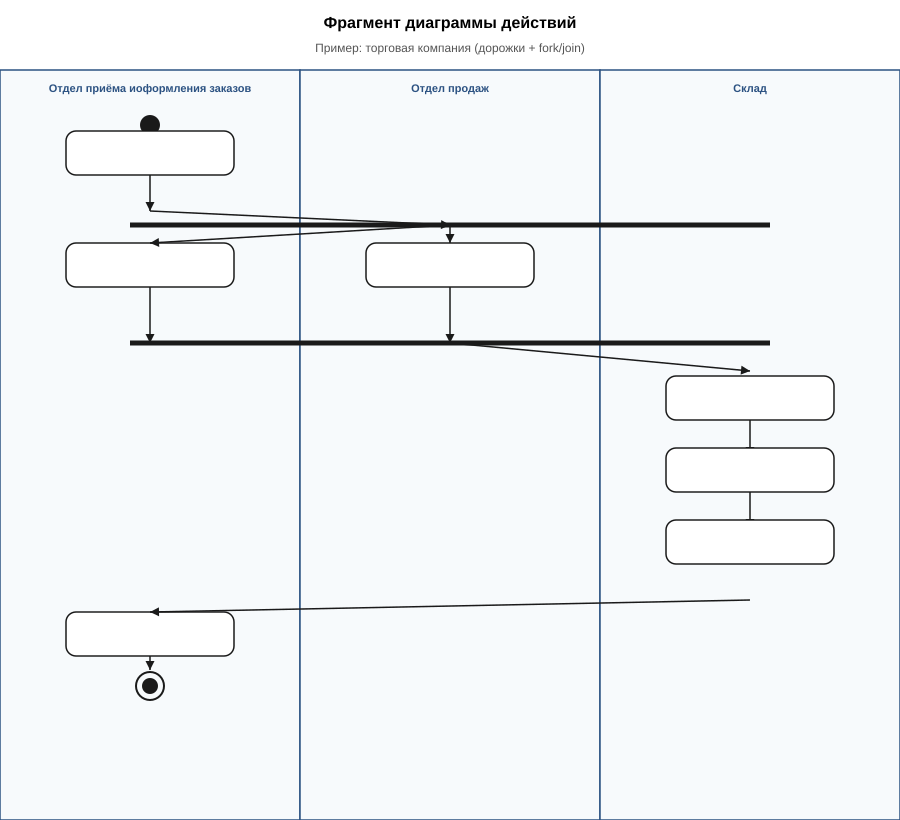

# UML Activity Diagram — веб-модуль отчётности ECO

**Диаграмма действий (Activity Diagram)** — поведенческая UML-диаграмма, показывающая **последовательность действий**, **ветвления по условию** и **параллельное выполнение** (fork/join). Отвечает на вопрос: *как именно* выполняется сценарий или алгоритм, шаг за шагом.

Документ предназначен для раздела диплома (моделирование поведения системы) и дополняет BPMN (`docs/diagrams/bpm/`), IDEF0 (`docs/IDEF0_ECO.md`) и DFD (`docs/diagrams/DFD_README.md`).

---

## Файлы диаграмм

| Рисунок | Назначение | Исходник (редактирование) | SVG (вставка в Word) |
|---------|------------|---------------------------|----------------------|
| Основная (ECO) | P-14 Экспорт журнала с дорожками | `docs/diagrams/activity-eco-p14-export.puml` | `docs/diagrams/activity-eco-p14-export.svg` |
| Пример (учебный) | Фрагмент с fork/join (торговая компания) | `docs/diagrams/activity-example-trading.puml` | `docs/diagrams/activity-example-trading.svg` |

**Пересборка SVG после правок:**

```bash
python3 scripts/generate_activity_svg.py
```

Исходники `.puml` можно править в [plantuml.com](https://www.plantuml.com/plantuml) и экспортировать SVG вручную; для диплома достаточно пересборки скриптом. Ширина в Word: **14–16 см** (портрет).

Связанные материалы: `docs/БИЗНЕС_ПРОЦЕССЫ_ECO.md` (P-14), `docs/diagrams/bpm/eco-bpmn-p14-export-journal.bpmn`.

---

## 1. Элементы нотации UML Activity

| Элемент | Обозначение | Назначение |
|---------|-------------|------------|
| **Начальный узел** | ● (закрашенный круг) | Старт сценария |
| **Действие (Action)** | Прямоугольник со скруглёнными углами | Одна атомарная операция («Принять заказ», «Сформировать файл») |
| **Переход** | Стрелка | Порядок выполнения |
| **Узел решения** | ◇ (ромб) | Ветвление: «да» / «нет» (опционально на диаграмме ECO) |
| **Fork / Join** | Горизонтальная жирная полоса | Параллельные ветки; join — синхронизация перед следующим шагом |
| **Дорожка (Swimlane / Partition)** | Вертикальный столбец | Кто выполняет действие (роль, подразделение, компонент) |
| **Конечный узел** | ◎ (круг в кольце) | Завершение сценария |

**Отличие от BPMN:** Activity Diagram ближе к **алгоритму и ролям**; BPMN — к **бизнес-процессу** с событиями, пулами и сообщениями. Для диплома допустимо показать **один** сквозной сценарий ECO в Activity и **четыре** процесса в BPMN (см. `docs/diagrams/bpm/README.md`).

---

## 2. Рекомендации к выполнению (диплом)

### Шаг 1. Выбрать один сквозной сценарий

- Один рисунок = **один** процесс с ясным началом и концом.
- Для ECO рекомендуется **P-14** (экспорт журнала): есть взаимодействие эколога, Django и API, удобен **fork/join** (параллельно: шаблон отчёта и загрузка операций).
- Другие кандидаты: P-01 (вход), P-17 (измерение), P-08 (контроль данных) — отдельные рисунки, не смешивать на одной диаграмме.

### Шаг 2. Задать дорожки (2–3 штуки)

| Дорожка | Содержание |
|---------|------------|
| **Эколог** (или администратор / руководитель) | Действия пользователя в браузере |
| **Веб-модуль ECO** | Обработка на Django: фильтры, сборка файла, редиректы |
| **API платформы** | REST-запросы к PostgreSQL (`waste_complex`) |

Не добавлять дорожку «Склад учёта» для процессов, которые в ECO только **читают** данные через API.

### Шаг 3. Разместить поток сверху вниз

1. Старт — в дорожке пользователя.  
2. Цепочка действий вниз; при смене исполнителя — переход в соседнюю дорожку (стрелка может пересекать границу).  
3. **Fork** — когда два действия **независимы** и могут идти параллельно (как в учебном примере: оплата и регистрация заказа).  
4. **Join** — обязателен перед шагом, которому нужны **оба** результата (на рисунке ECO: объединение данных перед формированием файла).  
5. Конец — в дорожке пользователя (результат для заказчика: скачанный отчёт).

### Шаг 4. Именовать действия

- Формулировка: **глагол + объект** («Запросить экспорт», «Получить операции за период»).  
- **Без** URL и HTTP-методов в подписях на рисунке (детали — в `БИЗНЕС_ПРОЦЕССЫ_ECO.md`).

### Шаг 5. Контрольный список перед сдачей

- [ ] Есть ровно один начальный и хотя бы один конечный узел.  
- [ ] Каждое действие связано стрелками (нет «висящих» блоков).  
- [ ] Fork и join **парные**: число входящих в join веток = число исходящих из fork.  
- [ ] Дорожки подписаны однозначно (роль или компонент).  
- [ ] На рисунке ECO отражён реальный процесс модуля (P-14), а не абстрактное «меню системы».  
- [ ] Подпись по ГОСТ 7.32: «Рисунок X – UML-диаграмма действий …» + ссылка в тексте.

### Шаг 6. Типичные ошибки

| Ошибка | Как исправить |
|--------|----------------|
| Все действия в одной дорожке | Разнести по пользователю / ECO / API |
| Fork без join | Добавить join перед общим шагом |
| Параллельные ветки по смыслу последовательны | Убрать fork; оставить линейную цепочку |
| Смешение нескольких процессов (вход + экспорт + дашборд) | Один рисунок — один процесс |
| Подписи `GET /api/...` | Заменить на бизнес-формулировки |

---

## 3. Основная диаграмма ECO (P-14)

**Процесс:** экспорт журнала операций движения отходов (P-14).  
**Исполнитель:** эколог (или суперпользователь).  
**Результат:** файл PDF или XML с теми же фильтрами, что и на экране журнала.

### Таблица — действия по дорожкам

| № | Дорожка | Действие | Примечание |
|---|---------|----------|------------|
| 1 | Эколог | Открыть журнал операций | `/operations/movements/` |
| 2 | Эколог | Задать фильтры | Организация, период, поиск |
| 3 | Эколог | Запросить экспорт | — |
| 3a | Эколог | Выбрать формат (PDF / XML) | Доступны только PDF и XML |
| 4a | Веб-модуль ECO | Подготовить шаблон PDF или XML | Параллельная ветка после fork |
| 4b | API платформы | Получить операции за период | `reporting/operations` |
| 5 | Веб-модуль ECO | Объединить данные и сформировать файл (PDF / XML) | После join |
| 6 | Эколог | Скачать отчёт | Конечный узел |

Вставьте в диплом: `activity-eco-p14-export.svg`.

---

## 4. Текст для раздела диплома (шаблон)

> Для описания динамики работы веб-модуля отчётности построена **UML-диаграмма действий** сквозного сценария экспорта журнала операций (рис. X). Диаграмма разделена на дорожки **«Эколог»**, **«Веб-модуль ECO»** и **«API платформы»**, что отражает распределение ответственности между пользователем, клиентским приложением на Django и единым REST API комплекса. Эколог выбирает формат выгрузки **PDF или XML**; после запроса экспорта параллельно выполняются подготовка шаблона отчёта и загрузка операций движения; узел слияния (join) синхронизирует ветки перед формированием файла. Такое представление дополняет BPMN-диаграмму процесса P-14 и функциональную модель IDEF0 блоком A3.

---

## 5. Пример ниже (учебный фрагмент)

Ниже — **фрагмент** диаграммы действий в формате «дорожки + fork/join» (как в методичке: торговая компания). Он иллюстрирует нотацию; **не** описывает предметную область ECO.

**Дорожки:** отдел приёма заказов → отдел продаж → склад.

**Логика:**

1. Принять заказ.  
2. **Fork:** параллельно «получить оплату» (отдел приёма) и «зарегистрировать заказ» (отдел продаж).  
3. **Join** → склад: отпуск, подготовка, отправка.  
4. Закрыть заказ → конец.

Файл для вставки в приложение или методический раздел: `activity-example-trading.svg`.



---

## 6. Соответствие другим моделям

| Модель | Связь с Activity ECO |
|--------|----------------------|
| BPMN P-14 | Тот же процесс; больше деталей по шлюзам и задачам |
| IDEF0 A3 | «Ведение журнала операций и экспорт отчётов» |
| DFD | Потоки данных к процессу «Экспорт журнала» |
| Use Case U10, U12 | Прецеденты журнала и экспорта на уровне комплекса |
