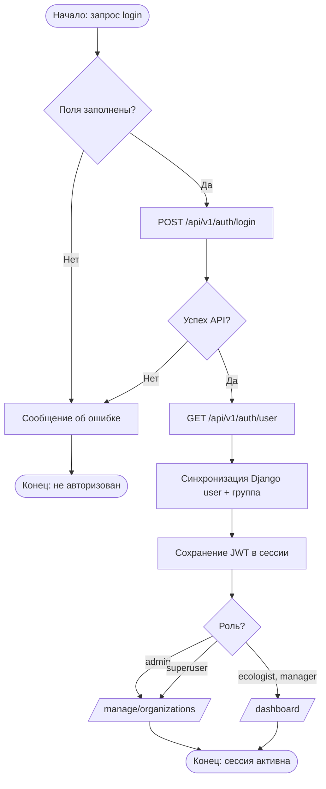
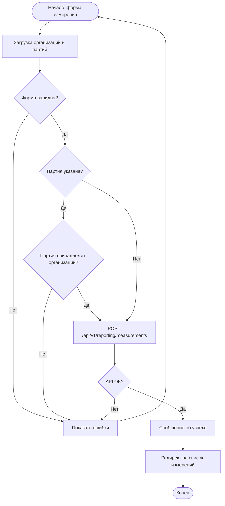
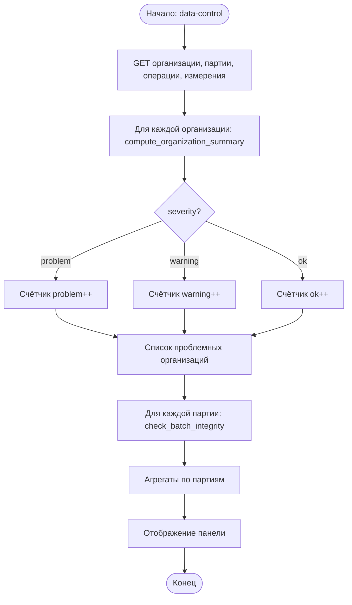
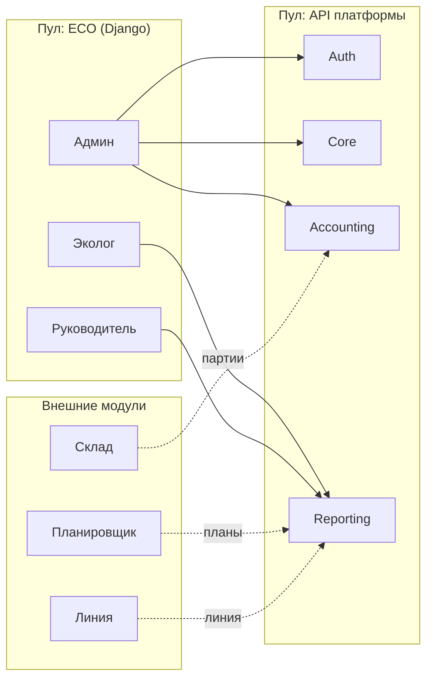

# Бизнес-процессы модуля отчётности ECO

Модуль **ECO** — клиент отчётности на Django 5.2. Данные хранятся на платформе (FastAPI + PostgreSQL); локально — только сессии и зеркало пользователей (SQLite). Большинство процессов — **чтение и аналитика**; запись в API из UI — регистрация пользователя (суперпользователь) и создание измерений (эколог).

Документ предназначен для раздела диплома «Бизнес-процессы» и для построения BPMN-диаграмм (Camunda Modeler, [bpmn.io](https://demo.bpmn.io/), Bizagi). UML Activity (дорожки, fork/join): `docs/UML_ACTIVITY_ECO.md`.

---

## 1. Участники (роли)

| Роль | Группа Django | Домашняя страница | Основные процессы |
|------|---------------|-------------------|-------------------|
| Анонимный пользователь | — | `/accounts/login/` | P-01, P-02 |
| Администратор | `eco_admin` | `/manage/organizations/` | P-06–P-12, P-08 |
| Суперпользователь | `is_superuser` | `/manage/organizations/` | Все + P-04, P-10 |
| Эколог | `eco_ecologist` | `/dashboard/` | P-13–P-18, P-19, P-20 |
| Руководитель | `eco_manager` | `/dashboard/` | P-19, P-20 (только просмотр) |

**Внешние участники** (другие модули комплекса; в ECO не реализованы, но данные потребляются):

- **Склад / учёт** — партии отходов (`/api/v1/accounting/batches`)
- **Планировщик** — KPI выполнения планов (дашборд отчётности)
- **Линия / мониторинг** — загрузка линии (дашборд отчётности)

---

## 2. Рекомендуемая структура BPMN для диплома

| Уровень | Диаграмма | Содержание |
|---------|-----------|------------|
| **Контекст (1 шт.)** | Collaboration | Пул «ECO», пул «API платформы», сообщения между ними; соседние модули — внешние участники |
| **Сквозные (2–3 шт.)** | Process | P-01 Аутентификация; P-17 Создание измерения; P-08 Контроль качества данных |
| **По подсистемам (4 шт.)** | Process + lanes | Администрирование (P-06–P-10); Справочники (P-11–P-12); Операции (P-13–P-15); Мониторинг (P-16–P-18); Дашборды (P-19–P-20) |

Не обязательно рисовать отдельную BPMN на каждый из 24 подпроцессов: процессы **просмотра списка** (P-06, P-09, P-11, P-13, P-16) объединяют в один шаблон «Запрос → API GET → Фильтрация → Отображение».

---

## 3. Каталог процессов

### 3.1. Доступ и маршрутизация

#### P-01. Аутентификация через API

| Поле | Значение |
|------|----------|
| **Триггер** | GET/POST `/accounts/login/` |
| **Исполнитель** | Любой пользователь |
| **Предусловие** | `USE_API_AUTH=true` (по умолчанию) |
| **Шаги** | 1) Ввод email и пароля → 2) `POST /api/v1/auth/login` → 3) `GET /api/v1/auth/user` → 4) Синхронизация Django-пользователя и группы роли → 5) Сохранение JWT в сессии → 6) Редирект на домашнюю страницу роли |
| **Решения** | Пустые поля → ошибка; ошибка API → сообщение; успех → редирект (админ → организации, эколог/руководитель → дашборд) |
| **Результат** | Активная сессия с токеном API |
| **URL** | `login` |

#### P-02. Выход из системы

| Поле | Значение |
|------|----------|
| **Триггер** | `/accounts/logout/` |
| **Шаги** | Очистка JWT в сессии → `django_logout` → редирект на login |
| **Результат** | Анонимный пользователь |

#### P-03. Маршрутизация с главной

| Поле | Значение |
|------|----------|
| **Триггер** | GET `/` |
| **Решения** | Не авторизован → login; админ/суперuser → `/manage/organizations/`; эколог/руководитель → `/dashboard/`; нет роли → login |

#### P-21. Контроль доступа к разделу

| Поле | Значение |
|------|----------|
| **Триггер** | Любой защищённый URL |
| **Решения** | Роль не подходит → сообщение + редирект на домашнюю страницу пользователя |
| **Реализация** | `GroupRequiredMixin`, `AdminRequiredMixin`, `EcologistRequiredMixin`, … |

---

### 3.2. Администрирование

#### P-04. Регистрация пользователя (суперпользователь)

| Поле | Значение |
|------|----------|
| **Триггер** | POST `/manage/users/add/` |
| **Исполнитель** | Суперпользователь |
| **Шаги** | Проверка прав → валидация формы (email, пароль, ФИО, роль) → `POST /api/v1/auth/register` (роль manager → `chief` в API) → сообщение об успехе |
| **Решения** | Не superuser → отказ; email занят (400/409) → ошибка формы |
| **Результат** | Учётная запись на платформе |
| **URL** | `administration:user_register` |

#### P-06. Просмотр реестра организаций

| Поле | Значение |
|------|----------|
| **Триггер** | GET `/manage/organizations/` |
| **Исполнитель** | Администратор, суперпользователь |
| **Шаги** | `GET /api/v1/core/organizations` + связанные партии/операции/измерения → расчёт сводки целостности по организации → фильтр/поиск/сортировка по severity |
| **Решения** | Фильтры: все / с проблемами / без партий / без измерений / неполные реквизиты |
| **Результат** | Таблица организаций с метками ok / warning / problem |

#### P-07. Карточка организации

| Поле | Значение |
|------|----------|
| **Триггер** | GET `/manage/organizations/<id>/` |
| **Шаги** | Загрузка организации → сводка → партии → последние 10 операций и измерений |
| **Решения** | Организация не найдена → HTTP 404 |

#### P-08. Контроль качества данных

| Поле | Значение |
|------|----------|
| **Триггер** | GET `/manage/data-control/` |
| **Исполнитель** | Администратор |
| **Шаги** | Агрегация severity по всем организациям → список проблемных → сводка по партиям |
| **Правила организации** | Проблемы: нет партий, нет измерений, нет операций, неполные реквизиты, проблемные партии. **severity=problem**: есть проблемные партии ИЛИ ≥3 замечаний; **warning**: есть предупреждения; иначе **ok** |
| **Правила партии** | Нет операций по org+типу отхода; нет измерений; объём операций < 50% объёма партии. **problem**: ≥2 issues; **warning**: 1 issue |
| **Результат** | Панель кросс-модульной согласованности данных |

#### P-09. Просмотр партий отходов

| Поле | Значение |
|------|----------|
| **Триггер** | GET `/manage/batches/` |
| **Шаги** | `GET /api/v1/accounting/batches` → проверки целостности → фильтр по статусу |
| **Примечание** | Жизненный цикл партии ведёт модуль учёта: `new` → `classified` → `in_storage` → `planned` → `in_process` → `completed` / `disposed` / `cancelled` |

#### P-10. Реестр модулей платформы

| Поле | Значение |
|------|----------|
| **Триггер** | GET `/manage/modules/` |
| **Исполнитель** | Только суперпользователь |
| **API** | `GET /api/v1/core/modules` |

---

### 3.3. Справочник типов отходов

#### P-11. Просмотр типов отходов (ФККО)

| Поле | Значение |
|------|----------|
| **Триггер** | GET `/waste/types/` |
| **API** | `GET /api/v1/core/waste-types` |

#### P-12. Создание / изменение / удаление типа отходов

| Поле | Значение |
|------|----------|
| **Триггер** | CUD `/waste/types/...` |
| **Решения** | При `USE_REMOTE_API=true` (по умолчанию) → предупреждение и редирект на список (запись только через API/импорт) |
| **Результат** | В штатном режиме CUD **заблокирован** |

---

### 3.4. Журнал операций (эколог)

#### P-13. Просмотр журнала движений

| Поле | Значение |
|------|----------|
| **Триггер** | GET `/operations/movements/` |
| **Исполнитель** | Эколог, суперпользователь |
| **Шаги** | `GET /api/v1/reporting/operations` → фильтры (организация, период, поиск) → пагинация |
| **Типы операций** | receipt, disposal, transfer, accumulation, recycling, removal |

#### P-14. Экспорт журнала

| Поле | Значение |
|------|----------|
| **Триггер** | GET export URL с теми же фильтрами, что и список |
| **Результат** | Файл `.pdf` или `.xml` |

#### P-15. CUD операций в UI

| Поле | Значение |
|------|----------|
| **Поведение** | При `USE_REMOTE_API=true` — блокировка (`RemoteApiReadOnlyMixin`); операции создаются другими модулями/API |

---

### 3.5. Мониторинг / измерения (эколог)

#### P-16. Просмотр измерений

| Поле | Значение |
|------|----------|
| **Триггер** | GET `/monitoring/measurements/` |
| **Шаги** | `GET /api/v1/reporting/measurements` → фильтр по организации, статусу (ok/bad — превышение нормы), поиску |

#### P-17. Создание измерения *(единственная штатная запись эколога)*

| Поле | Значение |
|------|----------|
| **Триггер** | POST `/monitoring/measurements/add/` |
| **Шаги** | 1) Загрузка списков организаций и партий → 2) Валидация (организация, параметр, значение, единица, опционально партия) → 3) Если партия указана — проверка принадлежности организации → 4) `POST /api/v1/reporting/measurements` → 5) Редирект на список |
| **Решения** | Партия не относится к организации → ошибка формы; ошибка API → ошибка формы |
| **Результат** | Запись измерения на сервере |

#### P-18. Изменение / удаление измерения

| Поле | Значение |
|------|----------|
| **Поведение** | При `USE_REMOTE_API=true` — заблокировано |

---

### 3.6. Аналитика и отчётность

#### P-19. Дашборд KPI

| Поле | Значение |
|------|----------|
| **Триггер** | GET `/dashboard/` (`date_from`, `date_to`) |
| **Исполнители** | Эколог, руководитель, суперпользователь |
| **Шаги** | Период по умолчанию — с начала года → агрегация операций и измерений на клиенте → объёмы по группам операций, превышения, организации без измерений, данные для Chart.js |
| **Решения** | `date_from > date_to` → обмен дат; ошибка API → пустые KPI + баннер |
| **Внимание** | Топ-5 недавних превышений; топ-5 организаций с операциями, но без измерений |

#### P-20. Отчётный дашборд

| Поле | Значение |
|------|----------|
| **Триггер** | GET `/dashboard/reporting/` |
| **Шаги** | `GET /api/v1/reporting/dashboard` + `/summary/by-hazard` + отфильтрованные партии/операции/измерения |
| **Фильтры** | Период, организация |

---

### 3.7. Служебные (вне UI)

| ID | Процесс | Описание |
|----|---------|----------|
| P-05 | `setup_roles` | CLI: создание групп и демо-пользователей |
| P-22 | Django Admin | `/admin/` — не рекомендуется для бизнес-данных |
| P-23 | `seed_demo` | Отключён: данные только с API |
| P-24 | Переход в соседние модули | Ссылки в шапке (API, Planning, ECO) |

---

## 4. Шаблон BPMN для процессов «только чтение»

Большинство процессов P-06, P-07, P-09, P-11, P-13, P-16, P-19, P-20 укладываются в один паттерн:

```
[Start] → [User Task: открыть раздел] → [Service Task: GET API] → {Gateway: данные?}
   ├─ нет / ошибка → [End: пустой список / сообщение об ошибке]
   └─ да → [User Task: фильтрация/просмотр] → [End]
```

Для экспорта (P-14) после фильтрации добавляется **Service Task: генерация файла** → **End Event: download**.

---

## 5. Диаграммы (Mermaid) — для вставки в работу или конвертации

### 5.1. P-01 Аутентификация



### 5.2. P-17 Создание измерения



### 5.3. P-08 Контроль качества данных



### 5.4. Контекст модуля в комплексе



---

## 6. Соответствие URL и процессов

| URL | Процесс |
|-----|---------|
| `/accounts/login/` | P-01 |
| `/accounts/logout/` | P-02 |
| `/` | P-03 |
| `/manage/users/add/` | P-04 |
| `/manage/organizations/` | P-06 |
| `/manage/organizations/<pk>/` | P-07 |
| `/manage/data-control/` | P-08 |
| `/manage/batches/` | P-09 |
| `/manage/modules/` | P-10 |
| `/waste/types/` | P-11 |
| `/waste/types/add|edit|delete/` | P-12 |
| `/operations/movements/` | P-13 |
| `/operations/movements/export/*` | P-14 |
| `/operations/movements/add|edit|delete/` | P-15 |
| `/monitoring/measurements/` | P-16 |
| `/monitoring/measurements/add/` | P-17 |
| `/monitoring/measurements/<pk>/edit|delete/` | P-18 |
| `/dashboard/` | P-19 |
| `/dashboard/reporting/` | P-20 |

---

## 7. Что указать в дипломе отдельно

1. **Ограничение записи**: флаг `USE_REMOTE_API` блокирует CUD справочников, операций и изменение измерений — модуль позиционируется как **отчётность и контроль**, а не как источник первичных данных.
2. **Единственные write-процессы UI**: P-04 (регистрация) и P-17 (измерение).
3. **Согласованность**: P-08 реализует бизнес-правила целостности между данными модулей учёта, отчётности и справочников.
4. **Связь с use case**: диаграмма `docs/diagrams/use_case_kompleks_simple.puml` — уровень комплекса; данный документ — детализация **только модуля ECO**.

---

## 8. Файлы BPMN 2.0 XML (для Word / диплома)

Для вставки в Word используйте **4 компактные** диаграммы (ширина ~1100 px, по одной на рисунок):

| Файл | Содержание | Процессы |
|------|------------|----------|
| `docs/diagrams/bpm/eco-bpmn-00-obzor.bpmn` | Обзор модуля (5 блоков) | — |
| `docs/diagrams/bpm/eco-bpmn-01-vhod.bpmn` | Вход в систему | P-01, P-03 |
| `docs/diagrams/bpm/eco-bpmn-02-admin.bpmn` | Администрирование | P-04, P-06—P-12 |
| `docs/diagrams/bpm/eco-bpmn-03-ekolog.bpmn` | Работа эколога | P-13—P-18 |
| `docs/diagrams/bpm/eco-bpmn-04-otchety.bpmn` | Отчётность и выход | P-19, P-20, P-02 |

Формат: один пул, 3 дорожки (Пользователь | Система ECO | API), как в учебном примере BPMN.

**Вставка в Word:** [demo.bpmn.io](https://demo.bpmn.io/) → Open File → **Export as SVG** или **PNG** → Вставка → Рисунок. Подпись: «Рисунок X — …». Масштаб в Word: ширина 14–16 см (портрет) или 20–22 см (альбом).

Полная схема (не для Word): `docs/diagrams/bpm/eco-all-processes.bpmn` — только для просмотра целиком.
